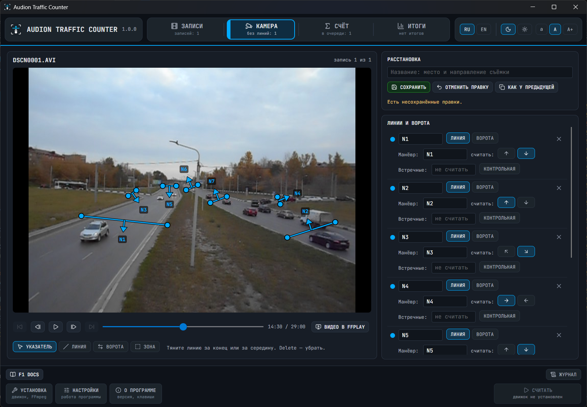

# Audion Traffic Counter

<!-- audion:release -->

  
  
  
  

**Version 1.0.0** · 2026-10-02 · 49.2 MB

- [Direct download](https://audion.dev/get/traffic-counter/1.0.0/Audion_Traffic_Counter_v1.0.0_Full.zip) — unmetered, no rate limits
- [Project page](https://audion.dev/downloads/traffic-counter) — every version and how to install

`SHA-256: c533ed85f6f8bc91a994915fd98897dcf3dcf7c4f5037198af2bcaa382efefac`

---

An **Audion** tool, published by [Tensionix](https://github.com/Tensionix).
<!-- /audion:release -->

[English README](Docs/README_EN.md) · [User Guide](Docs/USER_GUIDE_EN.md) | [Русский README](Docs/README_RU.md) · [Руководство](Docs/USER_GUIDE_RU.md)

**Contents**

- [Why](#why)
- [How it works](#how-it-works)
- [What is inside](#what-is-inside)
- [Which recordings it takes](#which-recordings-it-takes)
- [Starting](#starting)
- [What the program does not do](#what-the-program-does-not-do)
- [What it is made of](#what-it-is-made-of)

Counts vehicles in recordings of ordinary cameras: how many cars, buses, trucks and
motorcycles made each movement. Counting lines are drawn with the mouse right on the frame,
recordings go into a queue, and the queue counts itself - all night if need be. The count
runs on your machine: recordings are not sent anywhere.

## Why

A traffic survey is hours of recording from every spot, which somebody watches again and
counts by hand. The program does that count itself: a specialist draws the lines on the
frame of each recording and comes back to finished tables.

It is made for what there is in practice: old low-resolution recordings from consumer
cameras, tens and hundreds of files in a row.

## How it works

- A **line** is drawn across the road and counts the vehicles that cross it along its arrow.
  The arrow stands in the middle of the line and is turned round with one button.
- A **gate** is for an intersection and a roundabout: from the gates the program pairs the
  entry and the exit of one vehicle into a manoeuvre "from where → to where".
- A **zone** enlarges the far part of the frame, where vehicles take a few pixels.
- Every recording has a placement of its own. The buttons under the video lead through the
  recordings; the lines of the neighbouring recording are copied with one button.
- Every count is kept as a run of its own: runs of different models stand in one table,
  beside the manual count when there is one.

## What is inside

| Section | What it does |
|---|---|
| RECORDINGS | The list of videos: add files or a folder, mark what to count. The files stay where they are |
| CAMERA | The video with lines, gates and zones over it; going through the recordings; FFplay with the lines |
| COUNT | The model (YOLO26N … YOLO26X), what to count on, how many recordings at once, the queue, a trial run, the count as it goes |
| RESULTS | The history of runs, the table by movement and class with the total of vehicles, runs side by side and the check against a manual count |
| SETUP | The video cards of the machine and a button that installs exactly what it lacks |
| SETTINGS | How the program itself works: the speed of the count (recordings at once, threads, priority) and where the project file with the lines of the recordings is kept |

## Which recordings it takes

Files `.avi`, `.mp4`, `.mov`, `.mkv`, `.mts`, `.m2ts`, `.mpg`, `.wmv`, `.ts`, `.webm` with
the usual codecs: H.264, H.265, AV1, MJPEG, MPEG-2, MPEG-4. Files with other extensions do
not get into the list. The program was checked on an MJPEG AVI recording of 640x480, AV1 on
a short test clip; the other formats are read by the same libraries but were not tried on
recordings. An interlaced
recording (DV 720x576) has to be made progressive before it is counted.

## Starting

Start `Start.exe`, open the SETUP section and press **INSTALL WHAT IS NEEDED**: the program
downloads its own Python, PyTorch for your video card, TensorRT for an RTX card, the
detection library and FFmpeg into its own folder. Then follow the
[user guide](Docs/USER_GUIDE_EN.md).

The main way to count is an NVIDIA video card of the RTX series through TensorRT: a
half-hour recording of 640x480 takes about five minutes on an RTX 5070. An NVIDIA GTX card
counts through PyTorch (CUDA), several times slower. Without NVIDIA the program counts
through DirectML on any DirectX 12 video card, slower still.

## What the program does not do

It collects and sends no data; it goes to the network only for the installation and the
model weights. It installs nothing into the system: everything lives in its folder. It does
not read number plates. It does not split trucks by the number of axles: the classes are
car, bus, truck, motorcycle.

Accuracy depends on the size of a vehicle in the frame: near the camera the count agrees
with a manual one within one or two percent; far away some vehicles are lost, and the
smallest are not seen at all. Cars are told from the rest exactly, buses and trucks roughly.

## What it is made of

The window is C# on Avalonia 12 (.NET 10). The counting engine is Python: Ultralytics YOLO
and the ByteTrack tracker, PyTorch, TensorRT, ONNX Runtime with DirectML, OpenCV; FFmpeg
reads the video. Icons are Lucide, fonts are JetBrains Mono and Inter. Third-party programs and
libraries are downloaded by your button and keep their own licences.
